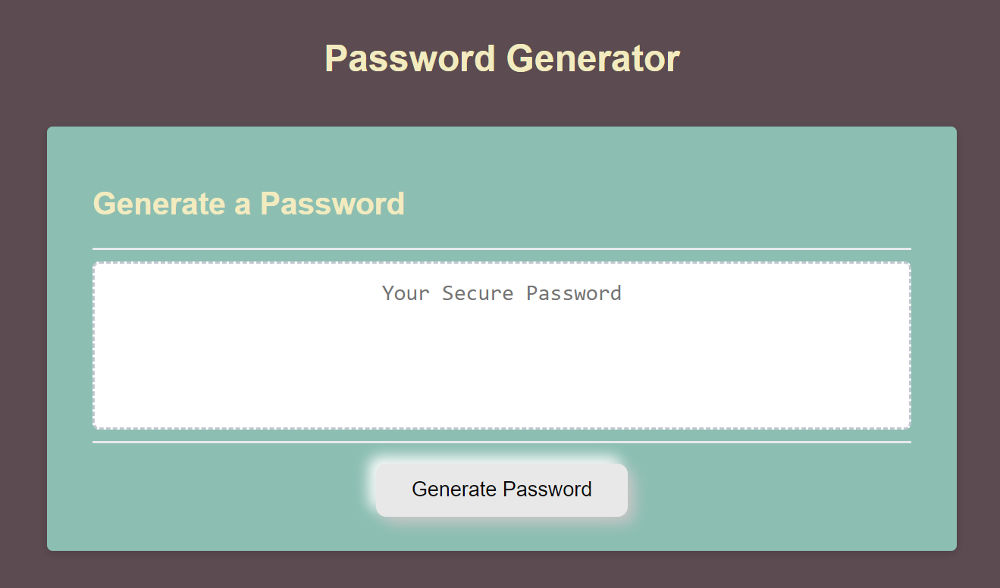

# Password Generator

Webpage to help you generate a random password based on certain criteria the user selects.

## Description 

 

With most websites wanting people to create accounts with their personal information, security never been more important. Using the same password for multiple accounts isn't the safest. Having a strong random password for each account is the best.
Users are asked a series of questions to help the website determine how long and what's included in the random password. 
The quesions include:
<li>If the user want lower and uppercase letters</li>
<li>If the user wants to include numbers</li>
<li>If the user wants to include special characters</li>

## Usage

Generates a random password with different criteria.

## Dependencies

1. A web browser
2. Internet
3. <a href="https://mscott-dev.github.io/Password-Generator/" alt="passwrod generator website">A link to the webpage</a>

## Installing
N/A

## Executing program

Just click generate password and answer the questions!

## Authors
Matthew Scott

